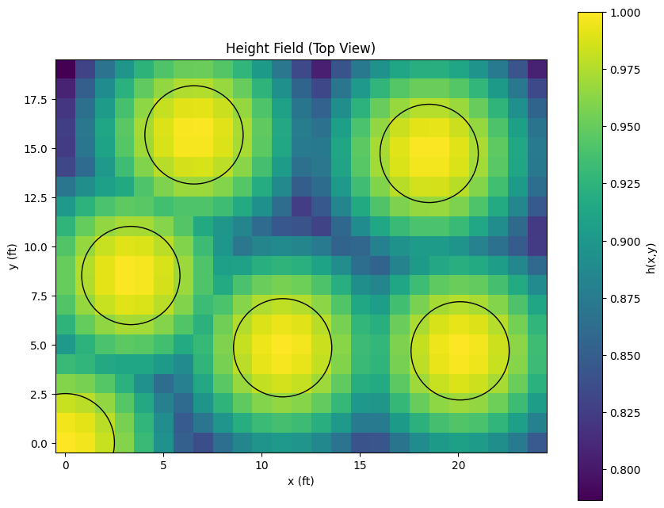

<h1>Sarno <small><small><small>(Quenya for "table")</small></small></small></h1>
Justin Tung, 2026

-------------------------------

## I. Overview
This is a quick weekend project to try to tackle a problem of how to arrange tables in a room in order to optimize the position of circular tables in a room.

## II. Modeling and Abstraction

The typical way problems I have seen problems like this are typically solved with pairwise distance calculations (edge-to-edge). I wanted to see if I could develop a different solution that is more fun, and maybe even more elegant.

The idea is that instead of modeling tables as circles on a flat plane. each table would be represented by its centerpoint on a flat surface. The surface would then be raised at each table center point, sloping outward to represent the idea that space closer to each table is more critical, and as space gets further away, more trivial.

The approach is to build a system that will find the optimal position of tables by maximizing the integral of the resulting graph. 

For instance, if all tables are along one wall, they are going to be tight together, and the rest of the room will be underutilized:

{width=60%}

conversely, if the tables are spread out from the walls, then their influence will saturate more of the room, representing utilized space throughout the room.

{width=60%}

This change can be measured by the increase in the space under the graph. Note that any given point will be mathematically influenced at any distance by every table. As such, the height of the graph at every point is the maximum of the influence by each table.

#### A. Pragmatic considerations

Several considerations were necessary to include in the model in order to ensure that the resulting output was useful. For instance, although tables are represented mathematically as a point, in reality, they have an exclusive radius. Therefore, instead of all points being valid within the inital plane, the coordinates of each table center point must instead be

$$r \leq x_i \leq W - r$$

where 
* `r` is the radius of the table, 
* `W` is the total length of the room in that dimension, and 
* `x` is the coordinate for any given table `i`. 

Additionally, while in reality, the tables could be pushed up on each other so they overlap, doing so would be functionally awkward and counterproductive. Therefore, the euclidian distance between every pair of table midpoints may not be smaller than two times the radius:

$$\lVert\mathbf{p}_i - \mathbf{p}_j\rVert \geq 2r$$

where 
* `p` is a table center point
* `i` and `j` are tables
* `r` is the radius of the tables

Finally, in the room that initiated this idea, the presenter stands presents from a corner where there is a lectern and a screen. Accordingly, this is modeled as an additional table center point in that corner, but it is not bound by the constraint that the table cannot be past the edge of the dimensions of the room.

#### B. Gaussian Table Representation

After assessing a few different possibilities, a Gaussian distribution was the best choice for how each table ought to augment the underlying field. this is because space around tables is not linearily usable. Given both the reality of humans sitting and the geometric propagaition of space around center points, the Gaussian distribution made sense to use. 

This is modeled as: 

$$I_i(\mathbf{x}) = e^{-\lVert\mathbf{x} - \mathbf{p}_i\rVert^2/\sigma^2}$$

where 
* `x` is the point being evaluated, 
* `p` is the table whose influence is being determined of count `i`, and '
* $\sigma$ is the standard deviation. 

$\sigma$ is defined as `g * r`, where `g` is a hyperparameter coefficient to represent table size, and `r` is the radius of the table. 

Written out fully, assuming `g` = 3, the equasion is given as follows:

$$I_i(\mathbf{x}) = \exp\left(-\frac{\lVert\mathbf{x} - \mathbf{p}_i\rVert^2}{9r^2}\right)$$

Therefore, across several different tables, the full model is: 

$h(\mathbf{x}) = \max_{i \in \{1...n\}} I_i(\mathbf{x})$

#### C. Integrating with Reimann Summation. 

Although each point can be evaluated with `h(x)` as defined above, finding the integral of the resulting function proved challenging. 

In pure form, the integrated equasion is 

$$J = \int_{\Omega} h(\mathbf{x}) \, d\mathbf{x} = \int_{\Omega} \max_{i=1,\ldots,4} e^{-\lVert\mathbf{x} - \mathbf{p}_i\rVert^2/(9r^2)} \, d\mathbf{x}$$

Assuming two dimentions `Ω = [0, W] x [0, H]`, this can be written as: 

$$J = \int_0^W \int_0^H \max_{i=1,\ldots,4} e^{-\lVert\mathbf{x} - \mathbf{p}_i\rVert^2/(9r^2)} \, dy \, dx$$

Instead of calcuating this integral, Reimann sums proved an effective strategy. Instead of calcuating the integral, a Riemann sum can be calculated with: 

$$J \approx \sum_{i=1}^{n_x} \sum_{j=1}^{n_y} h(x_i, y_j) \cdot \Delta x \cdot \Delta y$$

This summation is done at integer increments throughout the graph.

## III. Optimization

Following the aformentioned strategy, an effective model was built in vectorized numpy arrays where the value at any coordinate (x, y) is the Riemann sum of that point. Knowing this, eight input features can be defined. These can be represented as:

$$\mathbf{p} = \begin{bmatrix} x_1 \\\\ y_1 \\\\ x_2 \\\\ y_2 \\\\ \vdots \\\\ x_n \\\\ y_n \end{bmatrix} \in \mathbb{R}^{2n}$$

where `n` is the number of tables in the system. 

This vector, along with constraints and bounds, can be given to Scipy to optimize with  Sequential Least Squares Programming. Given the field generally not being all that jagged and having relatively few local minima/maxima, Sequential Least Squares Programming (SLSQP)seemed appropriate. Note that SLSQP is a minimization function, so resulting integrals were simply toggled to a negative. 

## IV. Results

The results seem accurate to the author's best determination. For instance, five tables, with a speaker's lectern at (0, 0), a table radius of 2, and a table scale of 2 yields this optimimal layout:

The numerical coordinates are:

    {
        "0": [
            8.506584482788352,
            3.3335544833515947
        ],
        "1": [
            15.662342222910373,
            6.549605388955559
        ],
        "2": [
            4.829951551393972,
            11.060596105002322
        ],
        "3": [
            14.719664060980543,
            18.51605374967795
        ],
        "4": [
            4.673051962320186,
            20.092302451446763
        ]
    }

## V. Discussion

Although this methodology seems promising and yields results which intuitively seem correct, adjusting hyperparameters may yield different results, especially the parameter for table scale which changes how important space is at any given distance from the table center. 
